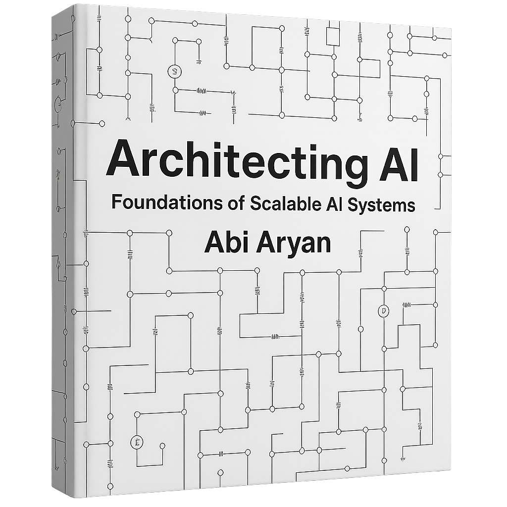

# Architecting AI by *Abi Aryan*
*Book Companion*

# Chapter 1. Foundations of AI System Architecture (Coming Soon!)
### *Allows you to build a solid foundation in AI system architecture, GPU fundamentals, and low-level performance engineering.*

Reference Reading:
1. AI Datacenter Energy Dilemma – Race for AI Datacenter Space. (2024, March 13). SemiAnalysis. https://semianalysis.com/2024/03/13/ai-datacenter-energy-dilemma-race/
2. Algazinov, A., Chandra, J., & Laing, M. (2025). INSIGHT: A Survey of In-Network Systems for Intelligent, High-Efficiency AI and Topology Optimization (No. arXiv:2505.24269). arXiv. https://doi.org/10.48550/arXiv.2505.24269
3. AMD Advancing AI: MI350X and MI400 UALoE72, MI500 UAL256. (2025, June 13). SemiAnalysis. https://semianalysis.com/2025/06/13/amd-advancing-ai-mi350x-and-mi400-ualoe72-mi500-ual256/
4. Asgar, Z., Nguyen, M., & Katti, S. (2025). Efficient and Scalable Agentic AI with Heterogeneous Systems (No. arXiv:2507.19635). arXiv. https://doi.org/10.48550/arXiv.2507.19635
5. Barros, S. (2025). Solving AI Foundational Model Latency with Telco Infrastructure (No. arXiv:2504.03708). arXiv. https://doi.org/10.48550/arXiv.2504.03708
6. Choukse, E., Warrier, B., Heath, S., Belmont, L., Zhao, A., Khan, H. A., Harry, B., Kappel, M., Hewett, R. J., Datta, K., Pei, Y., Lichtenberger, C., Siegler, J., Lukofsky, D., Kahn, Z., Sahota, G., Sullivan, A., Frederick, C., Thai, H., … Alben, J. (2025). Power Stabilization for AI Training Datacenters (No. arXiv:2508.14318). arXiv. https://doi.org/10.48550/arXiv.2508.14318
7. ClickHouse. (n.d.). Scaling observability at Character.AI: Thousands of GPUs, 10x logs, and 50% lower cost with ClickStack. ClickHouse. Retrieved August 29, 2025, from https://clickhouse.com/blog/scaling-observabilty-for-thousands-of-gpus-at-character-ai
8. Devansh. (2025a, June 19). The FLOPs Fallacy: Why Silicon Valley’s Compute Strategy is Dangerously Obsolete. Medium. https://machine-learning-made-simple.medium.com/the-flops-fallacy-why-silicon-valleys-compute-strategy-is-dangerously-obsolete-1e1e33ca1fcd
9. Devansh. (2025b, June 29). The GPU Monopoly is Over. The New AI Infrastructure Stack Part 1 [Investigations] [Substack newsletter]. Artificial Intelligence Made Simple. https://artificialintelligencemadesimple.substack.com/p/the-gpu-monopoly-is-over-the-new?utm_campaign=post&showWelcomeOnShare=true
10. Donta, P. K., Zhang, Q., & Dustdar, S. (2025). Performance Measurements in the AI-Centric Computing Continuum Systems (No. arXiv:2506.22884). arXiv. https://doi.org/10.48550/arXiv.2506.22884
11. Gholami, A., Yao, Z., Kim, S., Hooper, C., Mahoney, M. W., & Keutzer, K. (2024). AI and Memory Wall (No. arXiv:2403.14123). arXiv. https://doi.org/10.48550/arXiv.2403.14123
12. Google AI Infrastructure Supremacy: Systems Matter More Than Microarchitecture. (2023, April 12). SemiAnalysis. https://semianalysis.com/2023/04/12/google-ai-infrastructure-supremacy/
13. GPU Cloud Economics Explained – The Neocloud Hidden Truth. (2023, December 4). SemiAnalysis. https://semianalysis.com/2023/12/04/gpu-cloud-economics-explained-the/
14. How Hugging Face Scaled Secrets Management for AI Infrastructure. (n.d.). Retrieved August 29, 2025, from https://huggingface.co/blog/scaling-secrets-management
15. How to shuffle a big dataset. (n.d.). Jane Street Blog. Retrieved August 29, 2025, from https://blog.janestreet.com/how-to-shuffle-a-big-dataset/
16. Kepner, J., Byun, C., Anderson, L., Arcand, W., Bestor, D., Bergeron, W., Bonn, A., Burrill, D., Gadepally, V., Haney, R., Houle, M., Hubbell, M., Jananthan, H., Jones, M., Luszczek, P., Milechin, L., Morales, G., Mullen, J., Prout, A., … Michaleas, P. (2025). Easy Acceleration with Distributed Arrays (No. arXiv:2508.17493). arXiv. https://doi.org/10.48550/arXiv.2508.17493
17. Łańcucki, A., Staniszewski, K., Nawrot, P., & Ponti, E. M. (2025). Inference-Time Hyper-Scaling with KV Cache Compression (No. arXiv:2506.05345). arXiv. https://doi.org/10.48550/arXiv.2506.05345
18. C. R. W. (2025, January 6). Scaling Laws for LLMs: From GPT-3 to o3 [Substack newsletter]. Deep (Learning) Focus. https://cameronrwolfe.substack.com/p/llm-scaling-laws
19. Pilz, K. F., Sanders, J., Rahman, R., & Heim, L. (2025). Trends in AI Supercomputers (No. arXiv:2504.16026). arXiv. https://doi.org/10.48550/arXiv.2504.16026
20. Prabhakar, R., Sivaramakrishnan, R., Gandhi, D., Du, Y., Wang, M., Song, X., Zhang, K., Gao, T., Wang, A., Li, K., Sheng, Y., Brot, J., Sokolov, D., Vivek, A., Leung, C., Sabnis, A., Bai, J., Zhao, T., Gottscho, M., … Olukotun, K. (2024). SambaNova SN40L: Scaling the AI Memory Wall with Dataflow and Composition of Experts. 2024 57th IEEE/ACM International Symposium on Microarchitecture (MICRO), 1353–1366. https://doi.org/10.1109/MICRO61859.2024.00100
21. Scaling AI Infrastructure: Proven Patterns That Actually Work | WillDom. (2025, April 24). https://willdom.com/blog/scaling-ai-infrastructure/
22. Scaling AI-based Data Processing with Hugging Face + Dask. (n.d.). Retrieved August 29, 2025, from https://huggingface.co/blog/dask-scaling
23. Srigley, H. (2025, July 24). Are Your AI Servers Burning Cash? AI-CPUs Solve Inference Bottlenecks. NeuReality. https://www.neureality.ai/blog/ai-cpus-solve-inference-bottlenecks
24. The Ultra-Scale Playbook—A Hugging Face Space by nanotron. (n.d.). Retrieved August 29, 2025, from https://huggingface.co/spaces/nanotron/ultrascale-playbook
25. Wan, Z., Qian, J., Du, Y., Jabbour, J., Du, Y., Zhao, Y. K., Raychowdhury, A., Krishna, T., & Reddi, V. J. (2025). Generative AI in Embodied Systems: System-Level Analysis of Performance, Efficiency and Scalability (No. arXiv:2504.18945). arXiv. https://doi.org/10.48550/arXiv.2504.18945
26. Wang, Y., Li, Y., & Xu, C. (2025). Position: AI Scaling: From Up to Down and Out (No. arXiv:2502.01677). arXiv. https://doi.org/10.48550/arXiv.2502.01677
27. What is test-time compute and how to scale it? (2025, February 12). https://huggingface.co/blog/Kseniase/testtimecompute
